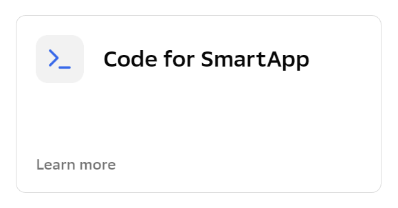
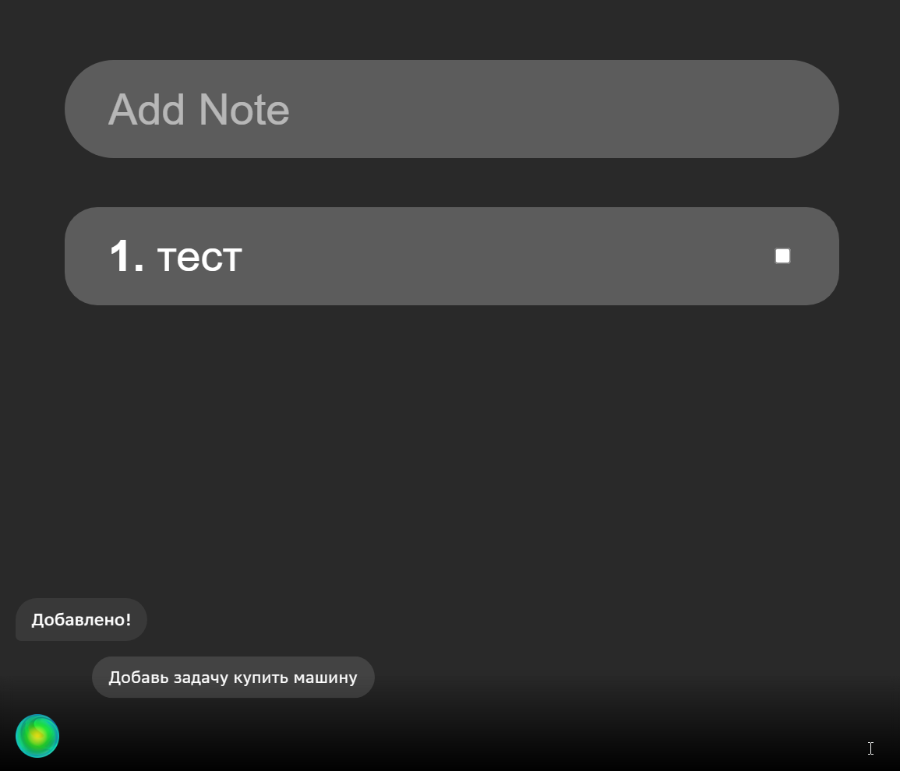

# salute-demo-app

Это небольшое Todo приложение (добавление, выполнение и удаление задач. [См. видео](https://youtu.be/P-o2rwHhARo)) демонстрирует пример взаимодействия с [Assistant Client](https://github.com/sberdevices/assistant-client). 

В данном репозитории находятся два приложения:
- приложение React, реализующее классическое демо-приложение To-do и использующее `assistan-client` для взаимодействия с бэкендом распознавания;
- архив `scenario-example.zip` - приложение Смарт-кода, выполняющееся на бэкенде распознавания речи и определяющее логику распознавания речи и голосового/текстового взаимодействия.
Обычного бэкенда, реализующего серверную логику и хранение данных, в этом приложении нет.

Для работы необходимо создать **два** проекта: один "SmartApp Code" (загрузив в него архив) и еще один - смартап в "SmartApp Studio", затем сгенерировать token и запустить приложение React.
                        

## Создание проекта "SmartApp Code":

1. Идём на страницу SmartMarket Studio ([ссылка](https://developers.sber.ru/studio/));
1. В меню слева нажимаем "Создать проект";
1. Выбираем "+ Создать проект" в левом меню или "Все инструменты" в верхней части страницы -> раздел "Мини-приложения Салют" -> **Code for SmartApp** (не спутайте с "Code for SaluteBot" - это __другой__ тип приложений)

   1. Выбираем "Пустой проект" -> Далее; 
   2. "Внешний репозиторий" не подключаем (хотя позже для своего приложения можете подключить) -> Пропустить 
   3. Указываем "Название проекта", например, зададим название "Список задач"; активируем "Добавить группу";
   4. Нажимаем "Создать проект";
   
1. В открывшемся проекте, в левом меню выбираем нижний пункт "Настройки проекта", потом переходим на закладку "Экспорт/Импорт", нажимаем на "Прикрепите файл";
1. Выбираем архив `scenario-example.zip` (лежит в корне этого проекта) -  не весь проект из Git, только zip-файл, который внутри этого проекта;
1. В левом меню выбираем "Редактор" -> "Сценарии";
1. Нажимаем "Собрать";
1. В левом меню выбираем  "Публикации";
1. Нажимаем "Получить вебхук" (выводится сообщение "URL хука для Сбера NLP 2.2 скопирован в буфер обмена").
                              

## Создание проекта "CanvasApp":

1. Идём на страницу SmartApp Studio ([ссылка](https://developers.sber.ru/studio/);
1.  Выбираем "+ Создать проект" в левом меню или "Все инструменты" в верхней части страницы -> раздел "Мини-приложения Салют" ;
1. Выбираем раздел "Мини-приложения Салют" -> **CanvasApp**
1. Указываем "Название смартапа" - лучше то же, что указывали в предыдущем разделе при создании приложения SmartApp Code (в общем случае они могут отличаться) - например, "Список задач"; 
1. У себя на диске в каталоге проекта копируем файл `.env.sample` в файл `.env`. В файле `.env` указываем название CanvasApp, заданное в предыдущем пункте, в строке `REACT_APP_SMARTAPP`); Обратите, пожалуйста, внимание на этот пункт - из-за него часто возникают трудно выявляемые проблемы;
1. Продолжаем создавать приложение в SmartApp Studio, в "Группа проекта" указываем ту же группу, которую создали в предыдущем разделе при создании приложения SmartApp Code, обычно она совпадает с названием приложения SmartApp Code (в общем случае это необязательно);
1. Нажимаем "Создать проект".
1. В левом меню выбираем шестеренку ("Параметры"); находим раздел "Сценарий смартаппа", выбираем Тип сценария "SmartApp Code API" и в поле "Внешняя ссылка" указываем URL на "Webhook" (полученный в "SmartApp Code");
1. Указываем URL на "Frontend Endpoint" (url страницы, где будет размещаться клиентская часть вашего приложения. **Для первого запуска, локального тестирования на своем компьютере не используется, можете указать любой)**;
1. Нажимаем "Сохранить" во всплывающей панели внизу.
                                   

## Генерация token:

1. Идём на страницу SmartApp Studio ([ссылка](https://developers.sber.ru/studio/);
1. В меню профиля (правый верхний угол) выбираем "Настройки профиля";
1. Нажимаем "Эмулятор";
1. Нажимаем "Обновить ключ";
1. Нажимаем "Скопировать ключ" (Появляется надпись "Выполнено. Ключ скопирован");
1. Указываем токен в файле `.env`, в строке `REACT_APP_TOKEN`.
               

## Запуск проекта:
              
Протестировано под Nodejs `18.15.0`.

1. Установить нужную версию Nodejs можно либо непосредственно с сайта, либо (рекомендуется) с помощью утилиты `nvm`, позволяющей быстро переключаться между версиями Node из командной строки (`nvm install 18.15.0`, `nvm use 18.15.0`).
                                 
2. Установить менеджер пакетов `yarn`, установить зависимости и запустить: 

```bash
npm install -g yarn
yarn               
yarn start
```
                                 
Если после установки `yarn` при попытке его запустить вы получаете сообщение `The term 'yarn' is not recognized`, см. раздел "Устранение проблем".

Эти же команды в менеджере пакетов `npm` (уже установлен по умолчанию вместе с Nodejs):

```bash
npm install      
npm start
```


3. Должен открыться веб-браузер со страницей приложения, в котором (кроме обычного визуального интерфейса) в нижней части появится панель Ассистента с шариком слева. Кликом на шарике можно включать/отключать распознавание речи. При отключенном распознавании текст можно вводить с клавиатуры в строке справа от шарика.
                             

4. При вращающемся шарике в этом приложении доступны следующие голосовые команды:
- "Добавь "тест",
- "Выполнил "тест",
- "Удали "тест". 

Не забудьте разрешить доступ страницы к микрофону.
                           
Если вам не нужно, чтобы новая вкладка браузера открывалась каждый раз при старте приложения, в файле `.env` добавьте строку

```dotenv
BROWSER=none
```

Внимание! При внесении изменений в файл `.env` приложение необходимо перезапустить.


# Устранение проблем

### Проблема

Большое количество сообщений `Failed to parse source map`:

```log
Module Warning (from ./node_modules/source-map-loader/dist/cjs.js):
Failed to parse source map from '(...)\salut-app\node_modules\@salutejs\plasma-typo\src\tokens.ts' file: 
Error: ENOENT: no such file or directory, open '(...)\salut-app\node_modules\@salutejs\plasma-typo\src\tokens.ts'
```

### Решение

Это - предупреждающие сообщения и не являются признаком ошибки.
При необходимости их отключить (не рекомендуется), можно добавить в файл `.env` следующую строку:

```dotenv
GENERATE_SOURCEMAP=false
```
                     
Внимание! При внесении изменений в файл `.env` приложение необходимо перезапустить.


## The term 'yarn' is not recognized
                     
### Проблема

Если вы работаете в Windows, и после установки `yarn` при попытке его запустить вы получаете сообщение `The term 'yarn' is not recognized`:
     
```log
yarn : The term 'yarn' is not recognized as the name of a cmdlet, function, script file, or operable program. Check the spelling of the name, or if a path was included, verify that the path is correct and try again.
```

### Решение

В Windows настоящее время по умолчанию используется командная строка PowerShell. В некоторых случаях PowerShell не может найти команду `yarn` после установки. Наиболее простой способ решить эту проблему - запустить более старый командный процессор Cmd.  В нём, как правило, всё работает. 
В случае, если это не решает проблему, можно использовать оригинальный менеджер пакетов `npm`. 


